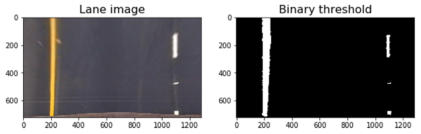

# Project 4 - Advanced Lane Finding

The steps of this project are the following:
- Step 1: Distortion correction using a calculated camera calibration matrix and distortion coefficients
- Step 2: Perspective transform to warp the image to a birds eye view perspective of the lane lines
- Step 3: Color thresholds to create a binary image which isolates the pixels of lane lines
- Step 4: Identify lane lines and fit polynomials to boundaries
- Step 5: Compute radis of curvature and vehicle position from center
- Step 6: Warp the detected lanes back to the original image
- Step 7: Display lane lines and estimation of curvature and vehicle position

### Step 1 - Distortion Correction
Use `findChessboardCorners` and `drawChessboardCorners` to identify the locations of corners on pictures of a chessboard of various angles.


Use OpenCV function `calibrateCamera` to compute the camera calibration matrix and distortion coefficients, given locations of the chessboard corners. Then use OpenCV function `undistort` to remove distortion from images, given the calibration matrix and distortion coefficients.


### Step 2: Perspective Transform
The goal of this step is to transform the undistorted image to a "birds eye view" of the road. The OpenCV functions `getPerspectiveTransform` and `warpPerspective` are used to take four source points on the undistorted image and map them to four destination points on the warped image. The source and destination points were selected manually by visualizing the locations of the lane lines on various test images.


### Step 3: Binary Threshold
Convert the warped image to different color spaces and create binary thresholded images which try to focus on detecting the lane lines. Through many experiments and inspiration from Udacity forum, I use the following combined color channels and thresholds to identify the lane lines:

The B channel from the Lab color space, with threshold of (150,200), which identifies yellow lines well but ignores white ones.
The L Channel from the LUV color space with threshold of (220,255), which identifies white lines well but ignores yellow ones.



### Steps 4: Fit a polynomial to lane lines

- Identify peaks in the histogram to determine location of lane lines.
- Identify all non zero pixels close to histogram peaks using `numpy.nonzero()`.
- Fit a polynomial to lanes using `numpy.polyfit()`.

### Steps 5: calculate vehicle position from the center of road

- Calculat the average of the x intercepts from two polynomials `position = (rightx_int+leftx_int)/2`
- Calculat the distance from center: `distance_from_center = abs(image_width/2 - position)`
- If the horizontal position of the vehicle was greater than `image_width/2`, than the vehicle is on the left of center, otherwise right.
- Convert pixels to meters by multiplying the number of pixels by `3.7/700` to get the distance from center.

### Steps 6: calculate radius of curvature:
The following code is used to compute the radius of curvature and take the average of left and right curve radiuses as final one:

```
ym_per_pix = 30./720 # meters per pixel in y dimension
xm_per_pix = 3.7/700 # meteres per pixel in x dimension
left_fit_cr = np.polyfit(lefty*ym_per_pix, leftx*xm_per_pix, 2)
right_fit_cr = np.polyfit(righty*ym_per_pix, rightx*xm_per_pix, 2)
left_curverad = ((1 + (2*left_fit_cr[0]*np.max(lefty) + left_fit_cr[1])**2)**1.5) / np.absolute(2*left_fit_cr[0])
right_curverad = ((1 + (2*right_fit_cr[0]*np.max(lefty) + right_fit_cr[1])**2)**1.5) / np.absolute(2*right_fit_cr[0])
```

### Step 7: Output visual display of the lane boundaries and numerical estimation of lane curvature and vehicle position.

Plot the polynomials on to the warped image, fill the space in-between to highlight the lane. Use perspective trasform again to warp the image from birds eye back to original perspective. Lastly print the distance and radius of curvature to the annotated image.


## Video Processing
The video processing pipeline is basically a repetation of step 7 from frame to frame. But to make the output smooth, I averaged the coefficients of the polynomials for each lane line over 10 frames. Specifically, classes for both the left and right lane lines are created to store necessary attributes. The pipeline also search recent frames for previously found lane lines and are able to search the entire image if no previous lines were found.

|Project Video|Challenge Video|
|-------------|-------------|
|||

The original video can be accessed here: 

The project video: https://drive.google.com/open?id=0B8g4mCBBmkoaejdsV3d5WkdiWHc

The challenge video: https://drive.google.com/open?id=0B8g4mCBBmkoacGF6TFhmUmVBZlE

### Reflections
This project pipeline has a robust performance on both the normal and challenge videos. It is capable of dealing with shadows in the second video. However, it does not perform very well on the even harder video, as the brightness is quite high on most of the images, which implies that the choosing of color space should be more robust in order to cope with more brightness/weather conditions. Especially for the third video, a color space that performs well on bright road surface should be combined into the binary thresholding. 


